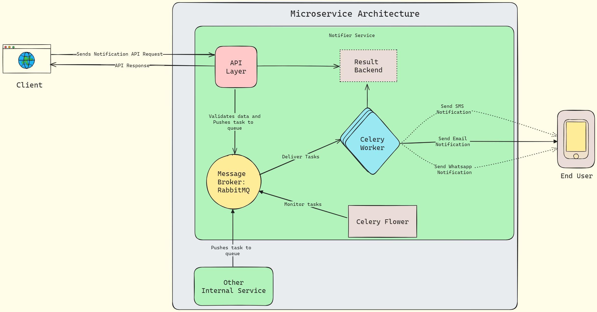

# Notify

This document outlines the design and planned development of a notification microservice.

## Architecture
<!-- \ -->

> Edit it [here](https://excalidraw.com/#json=gMcPDZ5cK93uxG6ygoRoa,TmbLmMhT0At2R7ZRFMZyLQ) 

## Key Features:
- **Scalable :** Easily add celery workers for increased notification volume.
- **Flexible Channels :** Works with email now, can add SMS & WhatsApp later (easy to expand).
- **Asynchronous Processing :** Improves API responsiveness with Celery & RabbitMQ.
- **Reliable Delivery :** Ensures important notifications with persistent delivery.

## Tech Stack
- **Backend :** Python 3
- **Framework :** FastAPI (for building the REST API)
- **Task Queue :** Celery (for asynchronous notification processing)
- **Message Broker :** RabbitMQ (for communication between FastAPI and Celery workers)
- **Testing :** Pytest with mocking libraries
- **Docker :** For containerization